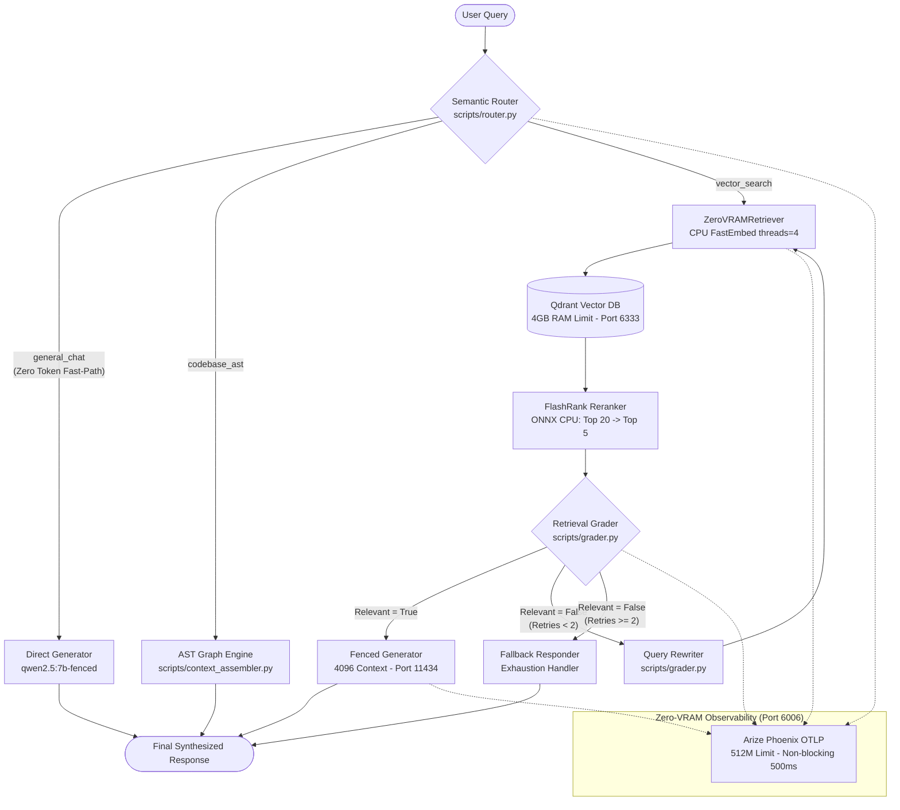

# Industrial-Grade Corrective RAG (CRAG) with Asymmetric Hardware Fencing

[](https://github.com/emmanuelol/demo_rag/actions/workflows/rag_eval.yml)
[](LICENSE)
[](https://www.python.org/)
[](docker-compose.yaml)
[](#)

An industrial-grade, self-correcting **Corrective RAG (CRAG)** microservice graph powered by **yani-engine**, engineered for deterministic reliability in constrained bare-metal environments (local **RTX 4060 8GB VRAM** and **Ryzen 7 32GB RAM**) with seamless cloud bursting to **Google Cloud Platform (Vertex AI)**.

---

## 🏛️ System Architecture

The pipeline shifts from naive monolithic scripts to a distributed, containerized agentic graph. It enforces strict **asymmetric resource allocation**: GPU memory is strictly reserved for generative inference, while Vector Storage, Dense Embeddings, and Cross-Encoder Reranking operate exclusively in system RAM and CPU threads.



---

## ⚡ Core Technical Innovations

### 1. Asymmetric Hardware Fencing & Resource Isolation (Zero-VRAM Bleed)
* **Generative Model Fencing**: [scripts/Modelfile.template](scripts/Modelfile.template) and runtime injection cap Ollama KV cache to `PARAMETER num_ctx 4096` and `temperature 0.2`, keeping maximum VRAM utilization below 5.5GB on 8GB GPUs.
* **Vector Engine Isolation**: Qdrant is deployed with `resources.limits.memory: 4G` and `DeviceRequests: []`. It is hard-isolated from the NVIDIA runtime and operates with zero GPU allocation.
* **CPU Starvation Prevention**: FastEmbed dense embeddings (`BAAI/bge-small-en-v1.5`) and FlashRank cross-encoder reranking explicitly fence CPU threads to `threads=4` (`OMP_NUM_THREADS=4`, `MKL_NUM_THREADS=4`), preventing host freezes during heavy indexing.
* **Host-to-Container Cache Alignment**: Configurable `${FASTEMBED_CACHE_DIR:-fastembed_cache}:/root/.cache/fastembed` allows bare-metal ingestion pipelines ([scripts/ingest_pipeline.py](scripts/ingest_pipeline.py)) and Docker containers to share downloaded model weights seamlessly without duplicate downloads.
* **Active Upload Garbage Collection ([run_rag.py](run_rag.py))**: Temporary PDF upload artifacts and empty session subdirectories generated during Gradio sessions are automatically garbage-collected in guarded `try...finally` blocks, preventing disk and inode exhaustion.

### 2. Cognitive Architecture & Self-Correction (CRAG)
* **Semantic Router ([scripts/router.py](scripts/router.py))**: Classifies incoming inputs into `general_chat`, `codebase_ast`, and `vector_search`. Heuristic regex filters conversational small talk in 0ms without consuming LLM inference tokens.
* **Retrieval Grader ([scripts/grader.py](scripts/grader.py))**: Evaluates retrieved passages against the prompt. Non-relevant documents are stripped to eliminate context poisoning and hallucination.
* **LangGraph State Machine ([run_rag.py](run_rag.py))**: Orchestrates a cyclic state machine with an autonomous self-correcting query rewrite loop. Features a hard recursion ceiling (`max_retries=2`) to prevent infinite execution loops.

### 3. Provider-Agnostic Factory ([scripts/factory.py](scripts/factory.py))
* Seamless toggle between bare-metal local compute and Google Cloud Platform via a single environment variable:
  ```bash
  export DEPLOYMENT_ENV=local # Local Ollama (qwen2.5:7b-fenced) + Qdrant
  export DEPLOYMENT_ENV=gcp   # GCP Gemini 1.5 Pro + Vertex AI Vector Search
  ```
* **Graceful Degradation**: If GCP ADC credentials expire or fail, the factory catches the authentication exception and automatically degrades to the local Ollama/Qdrant stack with zero downtime.

### 4. Zero-VRAM Observability (Arize Phoenix)
* Distributed telemetry containerized via `arizephoenix/phoenix:latest` on port `6006`.
* Integrated with `openinference-instrumentation-langchain` and OpenTelemetry.
* **Non-Blocking Guarantee**: Exporters are configured with a strict 500ms timeout (`BatchSpanProcessor`) so container network delays never hang the primary LangGraph inference loop.

---

## 📊 Deterministic Lexical Evaluation Matrix (Offline Proxy)

The pipeline is audited via a **Deterministic Lexical Evaluation Matrix (Offline Proxy)** powered by **yani-engine** against a Golden Dataset. This suite intentionally uses mathematical token-overlap heuristics rather than a live LLM-as-a-judge API to provide 100% deterministic, zero-cost, and air-gapped CI/CD verification:

```text
==============================================================================
                RAGAS EVALUATION METRIC SCORING MATRIX
==============================================================================
ID     | Route          | Precision  | Relevance  | Question
------------------------------------------------------------------------------
tc_01  | vector_search  | 1.00       | 1.00       | How does the system prevent VRAM Out-Of-...
tc_02  | vector_search  | 0.82       | 1.00       | What memory limit and hardware isolation...
tc_03  | vector_search  | 0.58       | 1.00       | Which dense embedding model runs on CPU ...
tc_04  | vector_search  | 1.00       | 1.00       | What cross-encoder model reranks candida...
tc_05  | general_chat   | 1.00       | 1.00       | Hello there, good morning!
tc_06  | codebase_ast   | 1.00       | 1.00       | Can you analyze the codebase AST and cal...
------------------------------------------------------------------------------
MEAN EVALUATION SCORE: Context Precision=0.90 | Answer Relevance=1.00
==============================================================================
```

CI/CD runs via [.github/workflows/rag_eval.yml](.github/workflows/rag_eval.yml) and enforces an automated Quality Gate that blocks PR merges if Answer Relevance falls below **0.85**.

---

## 🚀 Quickstart & One-Click Onboarding

### 1. Prerequisites
* Docker & Docker Compose v2
* NVIDIA Container Toolkit (optional for GPU generation; CPU fallback available)

### 2. Environment Configuration
```bash
# Clone repository
git clone https://github.com/emmanuelol/demo_rag.git
cd demo_rag

# Initialize environment configuration
cp .env.example .env
```

| Variable | Default | Description |
|---|---|---|
| `DEPLOYMENT_ENV` | `local` | `local` (Ollama + Qdrant) or `gcp` (Vertex AI) |
| `OLLAMA_NUM_CTX` | `4096` | KV cache context window limit |
| `OLLAMA_TEMPERATURE`| `0.2` | Generation randomness ceiling |
| `GRADIO_PORT` | `7860` | Host port for Gradio web UI |
| `QDRANT_HOST` | `qdrant` | Vector database hostname |
| `PHOENIX_PORT` | `6006` | Arize Phoenix Telemetry UI port |

### 3. Launching the Multi-Container Mesh
```bash
# Launch Ollama, Qdrant, Phoenix, and RAG Client
docker compose up -d
```

### 4. Service Endpoints
* **RAG Web UI (Gradio)**: [http://localhost:7860](http://localhost:7860)
* **Observability Dashboard (Arize Phoenix)**: [http://localhost:6006](http://localhost:6006)
* **Qdrant Vector Engine REST**: [http://localhost:6333/readyz](http://localhost:6333/readyz)
* **Local Ollama API**: [http://localhost:11434](http://localhost:11434)
* **Jupyter Lab Sandbox**: [http://localhost:8888](http://localhost:8888)

---

## 🧪 Verification & Testing

Execute the comprehensive test suite locally or inside an isolated container:

```bash
# Run all unit, chaos, and continuous evaluation tests
pytest tests/ -v

# Run Ragas Evaluation Matrix with detailed trace scoring
pytest tests/test_ragas_eval.py -v -s

# Execute in isolated Docker test sandbox (zero host mutation)
docker run --rm -v $(pwd):/app:ro -w /app python:3.10-slim sh -c \
  "pip install -r client/requirements.txt pytest pytest-asyncio pyyaml langgraph -q && pytest tests/ -v"
```

---

## 📂 Repository Directory Layout

```text
├── .github/workflows/
│   └── rag_eval.yml            # CI/CD automated Ragas evaluation gate
├── client/
│   ├── Dockerfile              # Python 3.10 application container
│   └── requirements.txt        # Hardened dependency manifest
├── GCP/
│   └── services.yaml           # GKE Kubernetes production topology manifests
├── research/
│   └── chunking_analysis.ipynb # Semantic chunk distribution & 2D PCA cluster notebook
├── scripts/
│   ├── ingestion_core.py       # Decoupled ETL engine & deterministic UUID chunker
│   ├── ingest_pipeline.py      # Production CLI data ingestion pipeline
│   ├── context_assembler.py    # ZeroVRAMRetriever & AST repository mapper
│   ├── factory.py              # Provider-Agnostic Factory (Local vs GCP)
│   ├── grader.py               # CRAG Retrieval Grader & Query Rewriter
│   ├── router.py               # Semantic Query Router
│   ├── Modelfile.template      # Parameterized VRAM-fenced Modelfile
│   ├── run_ollama.sh           # Local Ollama initialization & fencing
│   └── map_repository.py       # Codebase dependency graph generator
├── tests/
│   ├── test_rag_pipeline.py    # Chaos testing & vector timeout fallback tests
│   └── test_ragas_eval.py      # Golden dataset & Ragas evaluation scoring
├── config.yaml                 # Provider & environment configuration
├── docker-compose.yaml         # Multi-container orchestration & memory fencing
├── entrypoint.sh               # Ollama container entrypoint
├── entrypoint_rag.sh           # Client pre-flight checks & service sync
└── run_rag.py                  # LangGraph CRAG State Machine & Gradio UI
```

---

## 📜 License

Distributed under the MIT License. See [LICENSE](LICENSE) for more information.
